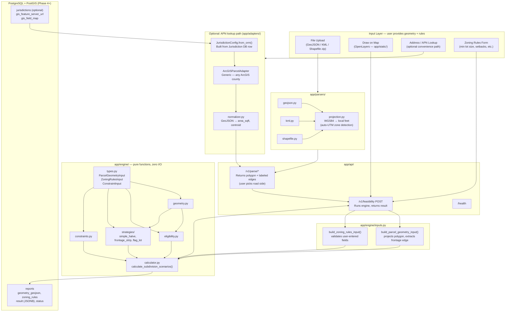
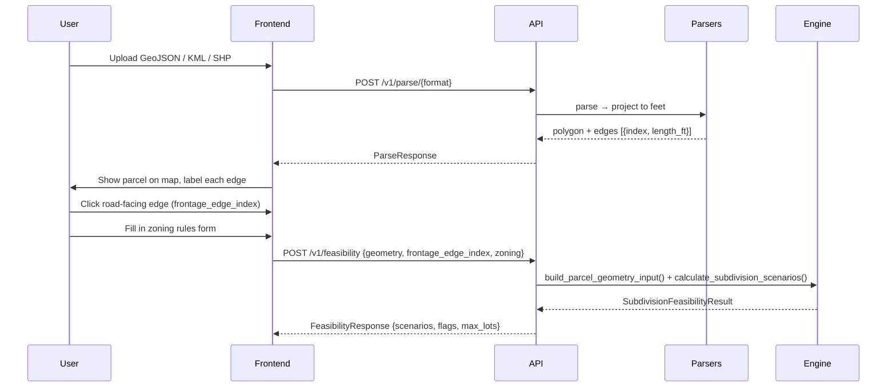
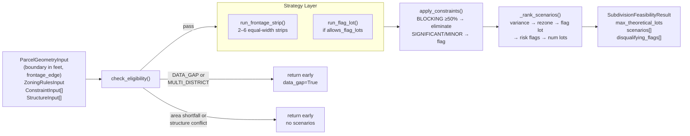
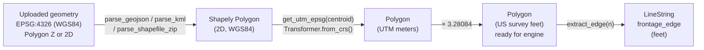
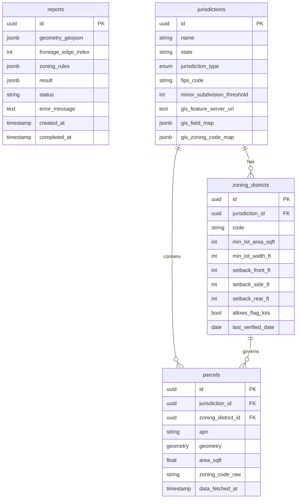
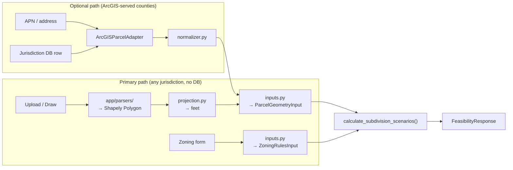

# Architecture

## System Overview

## Input → Parse → Select Edge → Run Flow

## Engine Data Flow

## Projection Pipeline

## Database Schema

> **Note:** The `reports` table is the primary table for the user-input flow and requires only PostgreSQL (no PostGIS). The `jurisdictions`, `zoning_districts`, and `parcels` tables support the optional APN-lookup path and are only needed if that feature is activated.

## Engine Isolation Contract

`app/engine/` is enforced (via AST scan in `tests/engine/test_engine_isolation.py`) to have zero imports from:

| Forbidden module | Why |
|---|---|
| `app.models` | No ORM types in engine inputs/outputs |
| `app.adapters` | Engine knows nothing about data fetching |
| `sqlalchemy` | No DB session leakage |
| `geoalchemy2` | Engine uses Shapely geometries only |
| `psycopg2` | No direct DB connections |

All engine inputs are plain Python dataclasses (`app/engine/types.py`). The calling layer (`app/engine/inputs.py` → `app/api/routes/feasibility.py`) is responsible for parsing uploaded geometry, projecting to feet, selecting the frontage edge, and constructing the input structs before calling `calculate_subdivision_scenarios()`.

## Two Input Paths

