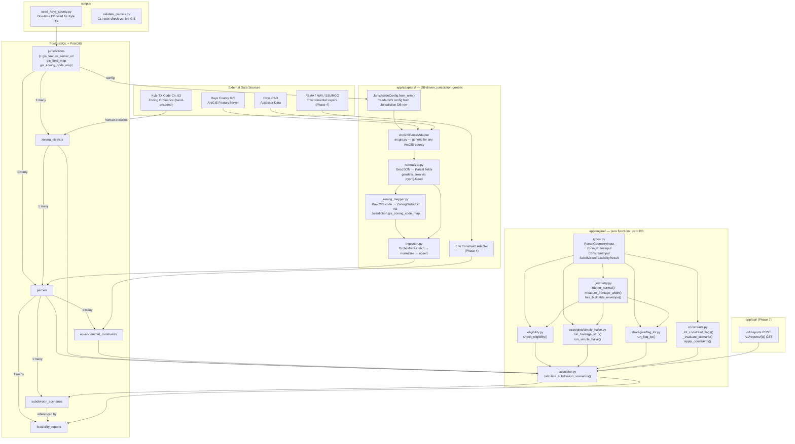
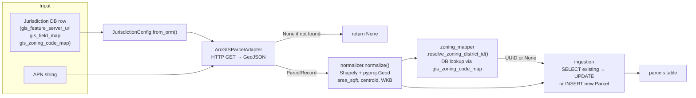
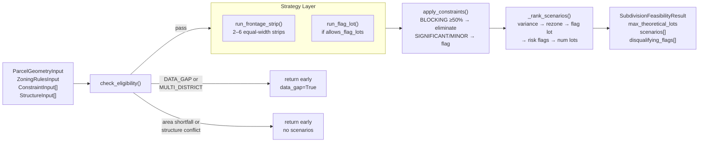
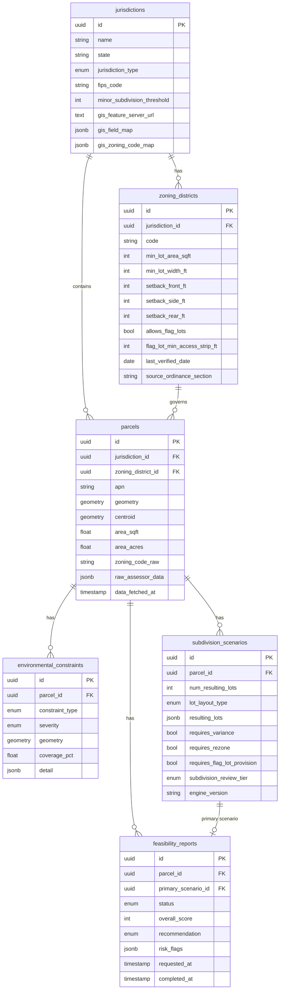

# Architecture

## System Overview

## Adapter Data Flow

## Engine Data Flow

## Database Schema

## Engine Isolation Contract

`app/engine/` is enforced (via AST scan in `tests/engine/test_engine_isolation.py`) to have zero imports from:

| Forbidden module | Why |
|---|---|
| `app.models` | No ORM types in engine inputs/outputs |
| `app.adapters` | Engine knows nothing about data fetching |
| `sqlalchemy` | No DB session leakage |
| `geoalchemy2` | Engine uses Shapely geometries only |
| `psycopg2` | No direct DB connections |

All engine inputs are plain Python dataclasses (`app/engine/types.py`). The calling layer (adapters → orchestration → API) is responsible for fetching data from the DB, projecting geometries to feet, and constructing the input structs before calling `calculate_subdivision_scenarios()`.

## Adding a New Jurisdiction

No new Python code is required. The steps are:

1. Create a seed script in `scripts/` that inserts one `Jurisdiction` row with:
   - `gis_feature_server_url` — the county's ArcGIS FeatureServer URL
   - `gis_field_map` — JSON mapping canonical roles to actual GIS field names
   - `gis_zoning_code_map` — JSON mapping raw GIS zoning strings to `ZoningDistrict.code` values
2. Manually encode `ZoningDistrict` rows for each relevant residential district (per spec §5.2), citing `source_ordinance_section` and setting `last_verified_date`.
3. Run the seed script against the target DB.

The `ArcGISParcelAdapter` and `ParcelIngestionService` require no changes.
